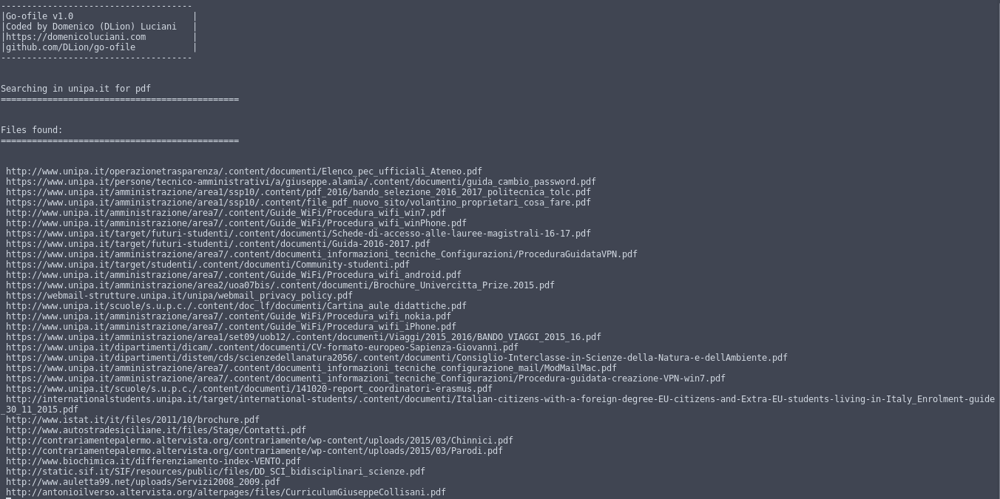

# go-ofile
Use this tool to search for a specific file type in a given domain.

Go lang clone of old [goofile](http://tools.kali.org/information-gathering/goofile) script.

## Usage

```
go-ofile
		-d domain
		-f filetype
```

## Example

`go-ofile -d unipa.it -f pdf`



## Author

Domenico Luciani
https://domenicoluciani.com

## License

MIT
